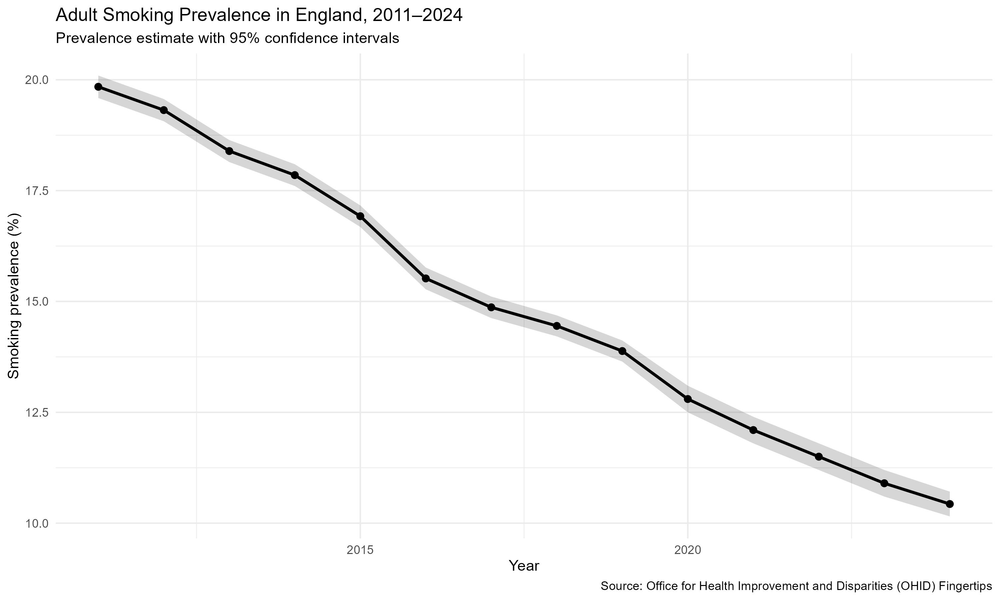

# Adult Smoking Prevalence Trend Analysis — England

## Overview

This project analyses the long-term trend in adult smoking prevalence in England using public-health surveillance data.

The project was developed as part of my **Public Health R Portfolio** to demonstrate practical skills in:

* Public-health data analysis
* Data cleaning and transformation
* Descriptive statistics
* Year-on-year trend analysis
* Confidence interval interpretation
* Linear regression
* Data visualisation using R
* Reproducible analytical workflows

The analysis was conducted in **R/RStudio** using the `tidyverse` ecosystem.

---

## Research Question

**How has adult smoking prevalence in England changed over the observed period, and what does the overall statistical trend show?**

---

## Data

The analysis uses adult smoking prevalence surveillance data for England obtained from the **Office for Health Improvement and Disparities (OHID) Fingertips** public-health data platform.

The dataset contains annual observations for:

* Adult smoking prevalence
* 95% confidence intervals
* Population count
* Year

The extracted dataset contains **14 annual observations**.

### Main variables used

| Variable             | Description                            |
| -------------------- | -------------------------------------- |
| `Year`               | Year of observation                    |
| `Smoking_Prevalence` | Estimated adult smoking prevalence (%) |
| `Lower_CI`           | Lower 95% confidence limit             |
| `Upper_CI`           | Upper 95% confidence limit             |
| `Count`              | Recorded population count              |

---

## Analytical Approach

The analysis followed a reproducible workflow:

### 1. Data preparation

The original surveillance dataset was imported into R and relevant variables were selected and renamed for analysis.

### 2. Descriptive analysis

I calculated:

* Number of years analysed
* Mean smoking prevalence
* Minimum prevalence
* Maximum prevalence
* Overall absolute change

### 3. Year-on-year analysis

Annual differences in smoking prevalence were calculated to identify years with the largest observed increases or reductions.

### 4. Confidence intervals

The width of the 95% confidence interval was calculated for each annual estimate to examine the precision of the prevalence estimates.

### 5. Linear regression

A simple linear regression model was fitted:

```r
Smoking_Prevalence ~ Year
```

This was used to quantify the overall linear temporal trend across the observed period.

### 6. Visualisation

Three main visualisations were produced using `ggplot2`:

1. Adult smoking prevalence over time with 95% confidence intervals
2. Year-on-year changes in prevalence
3. Linear regression trend

---

# Key Findings

## Descriptive findings

Across the 14 annual observations:

* **Mean smoking prevalence:** 14.9%
* **Minimum observed prevalence:** 10.4%
* **Maximum observed prevalence:** 19.8%

The observed prevalence therefore varied substantially across the period analysed.

---

## Year-on-year changes

The largest observed annual reductions were:

| Year | Smoking prevalence |           Annual change |
| ---: | -----------------: | ----------------------: |
| 2016 |              15.5% | −1.40 percentage points |
| 2020 |              12.8% | −1.08 percentage points |
| 2015 |              16.9% | −0.93 percentage points |
| 2013 |              18.4% | −0.92 percentage points |
| 2021 |              12.1% | −0.70 percentage points |

The largest observed year-on-year reduction occurred between **2015 and 2016**, when prevalence decreased by approximately **1.40 percentage points**.

These are descriptive changes in the surveillance data and should not be interpreted as evidence that a particular intervention, policy or event caused the observed annual change.

---

## Precision of estimates

The mean width of the 95% confidence intervals was approximately:

**0.526 percentage points**

The observed confidence-interval widths ranged from:

* **Minimum:** 0.474 percentage points
* **Maximum:** 0.600 percentage points

The confidence intervals provide an indication of statistical uncertainty around the annual prevalence estimates.

---

# Regression Analysis

A linear regression model was fitted to assess the overall temporal trend.

### Model

```r
lm(Smoking_Prevalence ~ Year, data = smoking)
```

### Results

| Statistic               |                        Result |
| ----------------------- | ----------------------------: |
| Year coefficient        | −0.754 percentage points/year |
| Standard error          |                        0.0184 |
| R²                      |                        0.9929 |
| Adjusted R²             |                        0.9923 |
| p-value                 |                  2.91 × 10⁻¹⁴ |
| Residual standard error |                         0.278 |

The estimated coefficient for year was **−0.754 percentage points per year**.

Within this dataset and model, the fitted linear trend therefore corresponds to an average reduction of approximately **0.75 percentage points in smoking prevalence per year**.

The model's R² of **0.9929** indicates that the linear time variable explains a very large proportion of the variation in this particular 14-year series.

The statistical association should not be interpreted as proof that the passage of time itself caused the decline. The analysis is observational and does not identify which policies, interventions, socioeconomic changes or other factors may have contributed to the observed trend.

---

# Visualisations

## 1. Adult smoking prevalence trend



The figure displays the annual prevalence estimate together with its 95% confidence interval.

---

## 2. Year-on-year change


This figure shows the change in prevalence between consecutive years.

Negative values represent reductions in prevalence, while positive values represent increases.

---

## 3. Linear regression trend


The regression visualisation illustrates the fitted linear trend across the observed period.

---

# Public Health Interpretation

The analysis demonstrates a clear downward temporal pattern in adult smoking prevalence across the observed England dataset.

From a public-health perspective, monitoring population smoking prevalence is important for assessing progress in tobacco control and identifying whether population-level patterns are changing over time.

However, national-level trend analysis alone cannot determine:

* Which interventions contributed to the reduction
* Whether reductions occurred equally across population groups
* Whether socioeconomic inequalities in smoking narrowed or widened
* The contribution of tobacco-control policy, cessation services or other determinants
* Whether the observed trend would have occurred in the absence of particular interventions

These questions would require additional data and analytical approaches.

---

# Limitations

Several limitations should be considered.

### 1. Observational data

The analysis describes associations and trends rather than causal relationships.

### 2. National-level analysis

The dataset analysed here represents England as a whole. National averages can mask important differences between:

* Local authorities
* Socioeconomic groups
* Age groups
* Sex
* Occupational groups
* Other population characteristics

### 3. Linear trend assumption

The regression model assumes a linear relationship between year and smoking prevalence. Real-world population trends may not follow a perfectly linear trajectory.

### 4. Limited number of observations

The analysis contains 14 annual observations. This limits the complexity of statistical modelling that can reasonably be applied to this dataset.

### 5. No adjustment for confounding

The regression model contains year as the only explanatory variable. It does not adjust for other factors that could influence smoking prevalence.

---

# Reproducibility

The project is structured to allow the analysis to be reproduced from the original data.

```text
Project 1 - Smoking Health Inequalities/
│
├── data/
│   └── Trends.csv
│
├── figures/
│   ├── smoking_prevalence_final.png
│   ├── year_on_year_smoking_change.png
│   └── smoking_trend_regression.png
│
├── outputs/
│
├── analysis.R
│
└── README.md
```

The complete analytical workflow is contained in:

**`analysis.R`**

---

# Tools and Skills Demonstrated

### Programming and analysis

* R
* RStudio
* `tidyverse`
* `dplyr`
* `ggplot2`
* Linear regression
* Descriptive statistics
* Confidence intervals
* Trend analysis

### Public Health

* Tobacco control
* Population health surveillance
* Epidemiological interpretation
* Public-health data interpretation
* Statistical uncertainty
* Evidence-based interpretation

### Reproducibility

* Structured project organisation
* Reproducible R script
* Automated figure generation
* Documented analytical methods

---

# Potential Next Steps

Future analysis could extend this project beyond the national trend by examining:

1. Smoking prevalence by **local authority**
2. Smoking prevalence by **deprivation**
3. Smoking inequalities between population groups
4. Geographic variation in smoking prevalence
5. Changes in inequalities over time
6. Relationship between smoking prevalence and other public-health indicators

These extensions would allow the project to move from a national trend analysis towards a more detailed **health inequalities and health intelligence analysis**.

---

## Author

**Ritika Rathod**

MPH (First Class Honours) | Public Health Practitioner

**Portfolio focus:** Public Health Analytics • Health Improvement • Tobacco Control • Epidemiology • Data Visualisation
